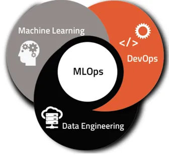

# Proyecto_Steam_Games
API para consultas especificas por año de juegos

PROYECTO MLOPS API PARA ESPECIFICAS CONSULTAS POR AÑO SOBRE JUEGOS

Para la realizacion de este proyecto se sumnistró una base de datos correspondiente a juegos, esta informacion está entre los años 1983 hasta 2021 y se encuentra contenida en un archivo .json llamada 'steam_games.json'.
cada uno de los registros de juegos en esta data tiene los campos 'publisher','genres', 'app_name', 'title', 'url', 'release_date', 'tags', 'discount_price', 'reviews_url', 'specs', 'price', 'early_access', 'id', 'developer', 'sentiment', 'metascore'.

Al obtener esta informacion se inicia con el estudio y trabajo de la data, donde según nuestra consideracion se realizan transformaciones necesarias que nos suminisre una data preparada de utilidad hacia el funcionamiento del proyecto.

Con esta informacion el paso a seguir es realizar  transformaciones de los datos para su procesamiento. En el archivo ETL.ipynb se encuentra el desarrollo de extraccion y transformacion de los datos, los cuales fueron:

1.  Importamos las librerias ast y pandas.
2.  Se abre el archivo en formato json "steam_games".
3.  Se toma a considerar campos especificos y crear un nuevo dataset, los cuales son requeridos para el    desarrollo de las funciones: 'title','genres','release_date','price','specs','early_access','metascore','sentiment'.
4. - Revisamos los valores unicos de genres y donde nos muestran cada uno de los generos.
   - Contamos la cantidad de nulos y se decide eliminarlos.
5. - En 'release_date' se guardan solo los registron que no tengan nula.
   - Se hace el cambio de formato de fecha a AAAA-mm-dd.
   - Se crea una nueva columna 'release_year', donde se extrae el año de especifico de lanzamiento.
6. - En 'price' convertimos el campo en numerico y rellenamos los no numericos en 0.
7. - En 'metascore' se cambia el campo 'metascore' a numerico.
   - Se considera borrar los nulos de los registros para obtener un campo limpio.

Al finalizar esta transformaciones el siguiente paso es realizar son las funciones demandadas para la creacion de la API. Para el desarrollo de la API con el dataset final se obtiene los datos necesarios para la creacion de la API. para esto se hace necesario FastAPI que permite crear aplicaciones en menos tiempo y requiere menos esfuerzo. y Render crear una imagen o vídeo con el que mostrar un concepto, idea o proyecto de forma digital y realista.

a la API se le suministran las siguiente funciones:

 1. def genero( Año: str ): Se ingresa un año y devuelve una lista con los 5 géneros más ofrecidos en el orden correspondiente.

2. def juegos( Año: str ): Se ingresa un año y devuelve una lista con los juegos lanzados en el año.

3. def specs( Año: str ): Se ingresa un año y devuelve una lista con los 5 specs que más se repiten en el mismo en el orden correspondiente.

4. def earlyacces( Año: str ): Cantidad de juegos lanzados en un año con early access.

5. def sentiment( Año: str ): Según el año de lanzamiento, se devuelve una lista con la cantidad de registros que se encuentren categorizados con un análisis de sentimiento.

6. def metascore( Año: str ): Top 5 juegos según año con mayor metascore.

Y por último, crear un modelo de predicción en el que, con las variables elejidas (metascore, y género), deberíamos predecir el precio del juego y el RMSE del modelo

CONTENIDO DEL REPOSITORIO
- ENTORNO VIRTUAL
- data_games.csv
- Diccionario de Datos.xlsx
- ETL-Steam_Games.pynb
- image.png
- requirements.txt
- steam_games

LINKS DE LA API 

- https://steam-ratg.onrender.com

 
 

